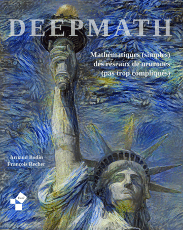

Deepmath : Mathématiques des réseaux de neurones
================================================

Ce livre comporte trois parties avec chacune un côté mathématiques et un côté réseaux de neurones :

* analyse et réseaux de neurones
* algèbre et convolution
* ChatGPT

Nouveau !
=========

* Version 2.0. 
* Inclusions de deux chapitres sur ChatGPT et les  grands modèles de langages.
* Explciations et scripts sont adaptés à Tensorflow 2.18 et Keras 3.10.

Livre
=====

Vous pouvez télécharger le livre en couleur sur ce site : [Livre 'Deepmath' (18 Mo)](livre-deepmath.pdf).

Vous pouvez obtenir une version papier en *noir et blanc* sur [Amazon](https://www.amazon.fr/dp/B08TRRNBMQ/) à prix coûtant.

Vidéos
======

Tout le cours est aussi expliqué en vidéos ! [Chaîne Youtube "Deepmath"](https://www.youtube.com/channel/UCnKarYaG1VuzdWix1vBitFg/)

Chapitres
=========

Partie I - Analyse - Réseaux de neurones
----------------------------------------

[Vidéos](https://www.youtube.com/playlist?list=PL4Z-Jb1iAUOZEjt0P6R1GPU5LhC1kx1aL)

* Dérivée [Chapitre](derivee/derivee.pdf)
* Python : numpy et matplotlib avec une variable [Chapitre](pythonx/pythonx.pdf)
* Fonctions de plusieurs variables [Chapitre](fonctions/fonctions.pdf)
* Python : numpy et matplotlib avec deux variables [Chapitre](pythonxy/pythonxy.pdf)
* Réseau de neurones [Chapitre](neurones/neurones.pdf)
* Python : tensorflow avec keras - partie 1 [Chapitre](pythontf1/pythontf1.pdf)
* Gradient  [Chapitre](gradient/gradient.pdf)
* Descente de gradient [Chapitre](descente/descente.pdf)
* Rétropropagation  [Chapitre](retro/retro.pdf)
* Python : tensorflow avec keras - partie 2 [Chapitre](pythontf2/pythontf2.pdf)

Partie II - Algèbre - Convolution
---------------------------------

[Vidéos](https://www.youtube.com/playlist?list=PL4Z-Jb1iAUOYxUtZO_NlXG21LoXYlwIOF)

* Convolution 1d [Chapitre](convolution1d/convolution1d.pdf)
* Convolution 2d [Chapitre](convolution2d/convolution2d.pdf)
* Convolution avec Python [Chapitre](pythonconv/pythonconv.pdf)
* Convolution avec Tensorflow/Keras [Chapitre](tfconv/tfconv.pdf)
* Tenseurs [Chapitre](tenseur/tenseur.pdf)
* Probabilités  [Chapitre](proba/proba.pdf)

[Vidéos proba](https://www.youtube.com/playlist?list=PL4Z-Jb1iAUObWRvZuQgPFUkUMP_Aycwdv)

Partie III - ChatGPT
--------------------

* ChatGPT - Partie 1 [Chapitre](chatgpt1/chatgpt1.pdf)
* ChatGPT - Partie 2 [Chapitre](chatgpt2/chatgpt2.pdf)

Compléments
------------------------------------

* Annexe [Chapitre](annexe/annexe.pdf)

Codes
=====

Vous trouverez les fichiers sources en naviguant dans les répertoires de [GitHub "deepmath"](https://github.com/exo7math/deepmath-exo7).

Le module 'keras_facile' conçu pour vous aider à démarrer  se trouve ici : [keras_facile.py](keras_facile/keras_facile.py).

Erreurs
=======

Merci de nous signaler toutes les éventuelles fautes (de calcul, de programmation, d’orthographe).

Auteurs
=======

Arnaud Bodin et François Recher

Merci à Michel Bodin pour sa relecture.
Merci à Kroum Tzanev pour ses figures de convolutions.
Nous remercions les lecteurs suivants pour leurs remarques pertinentes :
	Laurent Briend, 
	Francis Cougard,
	Gloria Faccanoni,
	Kévin François, 
	Thibault Godin,
	Alexandre Guénéguan,
	Aziz Jedidi,
	Éline Pot,
	Mathieu Sanchez,
	Frédéric Sanchez.

Ce livre est diffusé sous la licence *Creative Commons -- BY-NC-SA -- 4.0 FR*.

